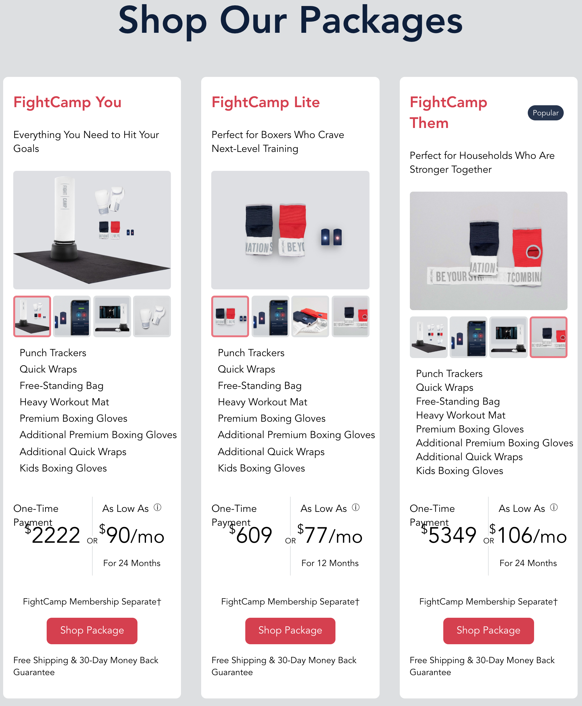
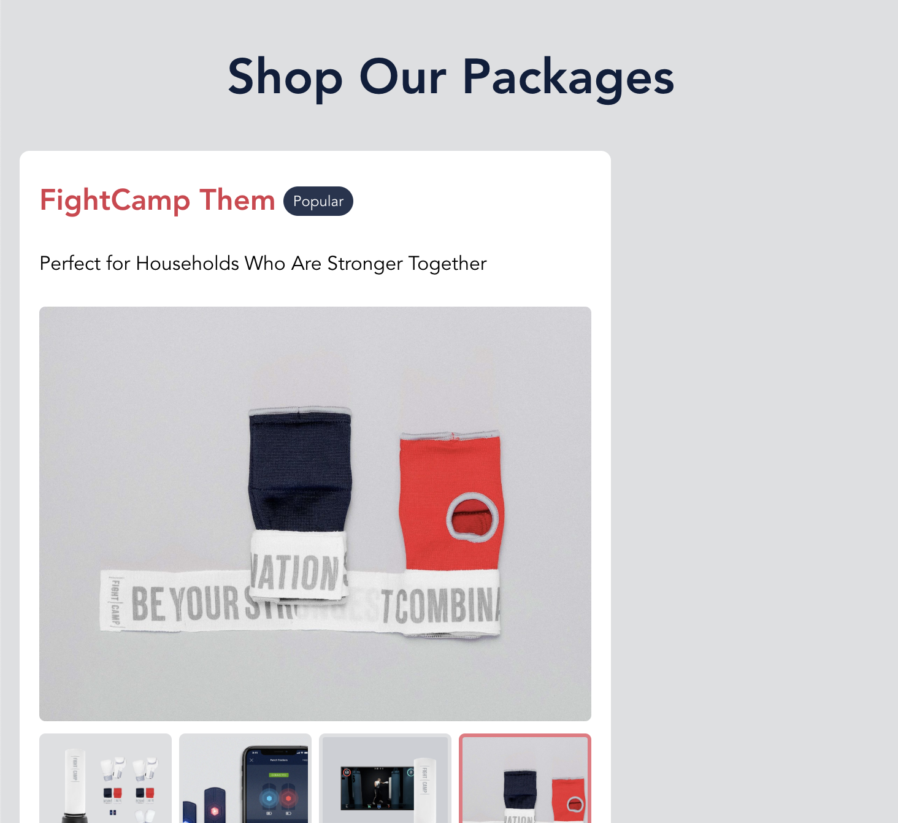
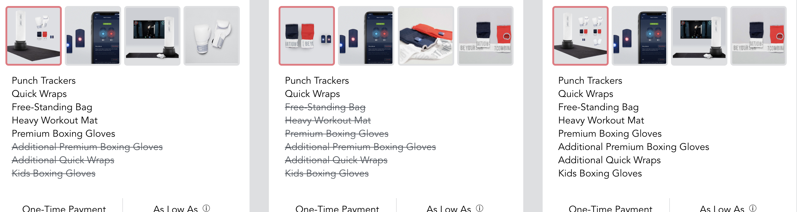

# FightCamp's Take Home Challenge 🥊

Hey! Congratulations on making it to the next step in the interview process. We look forward to having you potentially join the FightCamp family!

The FightCamp challenge is an opportunity for you to demonstrate your problem solving skills, your perspective on code maintenance, and your communication style.

## Expectations

We have created a component which contains a few bugs and can be severely improved.
There are 4 challenges that we would like you to complete. We have also included 1 BONUS challenge if you feel up to the task.

### Time Allotment
We understand that your time is valuable, and in order to respect your time we have designed the challenge to take about 1 hour. We are always improving our process, so if you have any suggestions please let us know.

### Project Submission
Fork this repository.

Solve the challenges.

Create a `README` with the following items:

* Description of the problem and how you solved it.
* The reasoning behind your decisions.
* Any other information you believe is necessary for us to know about the issue/solution.

Try your best to keep a clean commit history so that we may best review your solutions.

Please solve the 4 required challenges (and maybe the BONUS challenge) below. Once completed, email us a link to your forked GitHub repo.

# The Exercises

## 1. Screen Scaling Issue [easy]
  When you run the Vue application you will notice on the screen three package columns. When scaling the screen down the elements within the package are no longer aligned (see image below). Notice the alignment of the ImagePresenter, titles, headers, items, and the payment information (prices do not reflect our actual pricing). Use `CSS` to fix the scaling issue so that when the screen scales down the packages and package information remain aligned. Explain the problem and solution in your `README`.

  

## 2. Mobile Package Centering [easy]
If you scale the window down further (around 767px width), you will notice the single package is not centered with the title (see image below) of the page. Please use `CSS` to center the package.

  

## 3. Included Items [easy]
Fix the `itemIncluded` method so that is correctly applies the `packages-block-item-not-included` class.
It should look like the screenshot below:

## 4. Refactor [normal]
  Refactor the `Packages.vue` code as you see fit to increase clarity and reusability. Explain your decisions in your `README`.

## 5. BONUS [hard]
  You might have noticed that the ImagePresenter is not correctly focusing on the clicked thumbnail images and making them the current image. This issue happens if you scroll down or resize the browser. Refer to the first and second screenshots for examples on how it should work/look. Without touching the `ImagePresenter.vue` code, fix the image selection issue and explain the problem.
